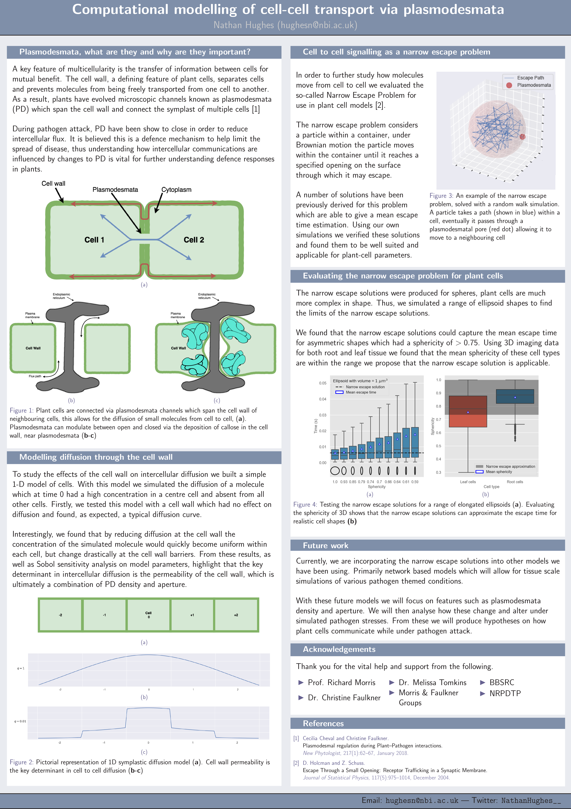

# Example academic poster template, written in LaTeX. 

- Should work with standard latex compile command which you use on your system
- Colours can be edited in the sty file
  - Currently using Nordic themed colours 

